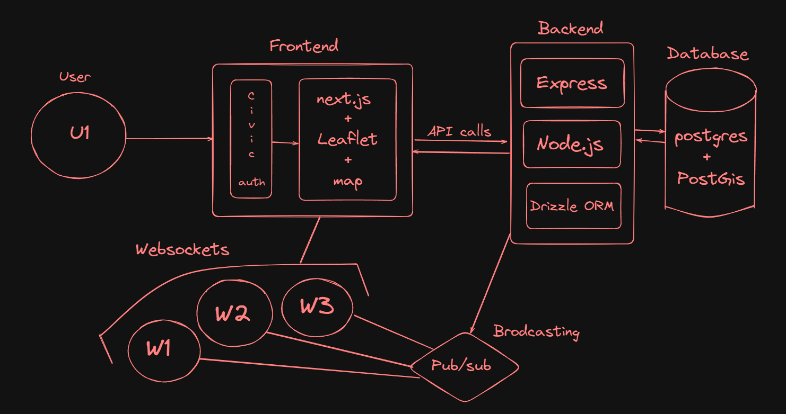

# 🚀 rivet — Real-Time Service Booking Platform

[](LICENSE)
[](https://nodejs.org/)
[](https://www.postgresql.org/)
[](https://aptos.dev/)

---

**rivet** is a full-stack, real-time service booking platform where users can instantly book skilled workers (plumbers, electricians, mechanics, and more). It features live worker tracking, AI-powered voice booking, blockchain-backed job verification, and a modern, scalable architecture.




---

## 🧠 Features

- 🔁 **Real-time worker tracking** (Socket.IO + Leaflet)
- 🎙️ **Voice-based job booking** (Gemini API)
- ⚡ One-tap service booking
- 📍 Location-aware search (10km radius)
- 🤖 Smart job-worker matching (AI)
- 💬 **Redis**-based real-time job push (Pub/Sub)
- 💸 Payments with **Razorpay**
- ⛓️ **Blockchain-backed** booking ledger (Aptos)
- 🔐 Secure authentication (JWT / Clerk)
- 📊 Admin & user dashboards

---

## 📦 Tech Stack

| Layer      | Stack                            |
| ---------- | -------------------------------- |
| Frontend   | Next.js, TypeScript, TailwindCSS |
| Realtime   | Socket.IO, Redis Pub/Sub         |
| Backend    | Node.js, Express, Drizzle ORM    |
| Database   | PostgreSQL + PostGIS             |
| AI         | Gemini API                       |
| Blockchain | Aptos (Move smart contracts)     |
| Maps       | Leaflet.js (OpenStreetMap)       |
| Payments   | Razorpay                         |

---

## 🗂️ Folder Structure

```
rivet/
├── ai/                  # AI/ML scripts (Gemini integration)
├── Backend/             # Node.js backend (Express, Drizzle, Sockets)
│   ├── src/
│   │   ├── app.ts
│   │   ├── server.ts
│   │   ├── config/      # Env, Redis, Drizzle DB
│   │   ├── routes/      # Express Routes
│   │   ├── controllers/ # API Logic
│   │   ├── sockets/     # Socket.IO events
│   │   ├── db/          # Drizzle ORM schema
│   │   ├── jobs/        # Queue jobs
│   │   ├── utils/       # Utilities
│   │   └── types/       # TypeScript types
│   └── ...
├── Blockchain/          # Aptos Move smart contracts
├── frontend/            # Next.js frontend
│   ├── src/
│   │   ├── app/         # App routes & pages
│   │   ├── components/  # Shared React components
│   │   └── lib/         # Client-side utilities
│   └── ...
└── ...
```

---

## ⚙️ How It Works

### User Flow

1. User enters location or uses GPS
2. Searches for a job (e.g., "pipe leak")
3. System shows nearby available workers (within 10km)
4. User books → Worker gets real-time notification
5. If worker accepts → live socket room connects
6. Worker's live location is tracked until job is done

### Worker Flow

- Workers receive broadcast jobs via **Redis**
- Can accept/reject jobs (first come, first serve)
- On acceptance, status is tracked: `pending → confirmed → completed`

---

## 🧠 AI-Powered Matching

- Voice-to-text job description (Gemini API)
- AI suggests best worker (rating, availability, distance)

---

## 💰 Payment Integration

- Secure checkout with **Razorpay**
- Escrow logic (user pays, worker gets paid after job)
- Transaction history linked to blockchain

---

## ⛓️ Blockchain Integration (Aptos)

Every completed job is recorded on-chain:

- Job ID
- User & Worker ID
- Timestamps
- Type of service

This provides **immutability** and **proof of service** for auditing and verification.

---

## 🛠️ Local Development Setup

### Prerequisites

- Node.js 18+
- PostgreSQL 14+
- Redis
- (Optional) Aptos CLI for blockchain

### 1. Clone the repository

```bash
git clone https://github.com/yourusername/rivet.git
cd rivet
```

### 2. Install dependencies

```bash
# Backend
cd Backend
npm install

# Frontend
cd ../frontend
npm install
```

### 3. Setup environment variables

- Copy `.env.example` to `.env` in both `Backend` and `frontend` folders and fill in required values.

### 4. Start services

```bash
# Start Redis (in a new terminal)
redis-server

# Start Backend
cd Backend
npm run dev

# Start Frontend
cd ../frontend
npm run dev
```

---

## 🖼️ Screenshots / Demo

> _Add screenshots or a demo GIF here_

---

## 📌 Roadmap

- [x] Real-time worker tracking
- [x] Redis Pub/Sub worker notifications
- [x] Voice-based job search (Gemini)
- [x] Razorpay payment gateway
- [x] Aptos blockchain logging
- [x] Admin & user dashboards
- [ ] Worker dashboard improvements
- [ ] Mobile app (Flutter)
- [ ] Multi-language support
- [ ] Automated CI/CD

---

## 🤝 Contributing

Contributions are welcome! To get started:

1. Fork the repo
2. Create a new branch (`git checkout -b feature/your-feature`)
3. Commit your changes (`git commit -am 'Add new feature'`)
4. Push to the branch (`git push origin feature/your-feature`)
5. Open a Pull Request

Please read the [Code of Conduct](CODE_OF_CONDUCT.md) and [Contributing Guidelines](CONTRIBUTING.md) (if available).

---

## 📄 License

MIT © 2025 Akash Laha

---

## 🌐 Live Demo

> _Coming Soon at [https://rivet.app](https://rivet.app)_

---

_Questions? Suggestions? Open an issue or contact the maintainer!_
