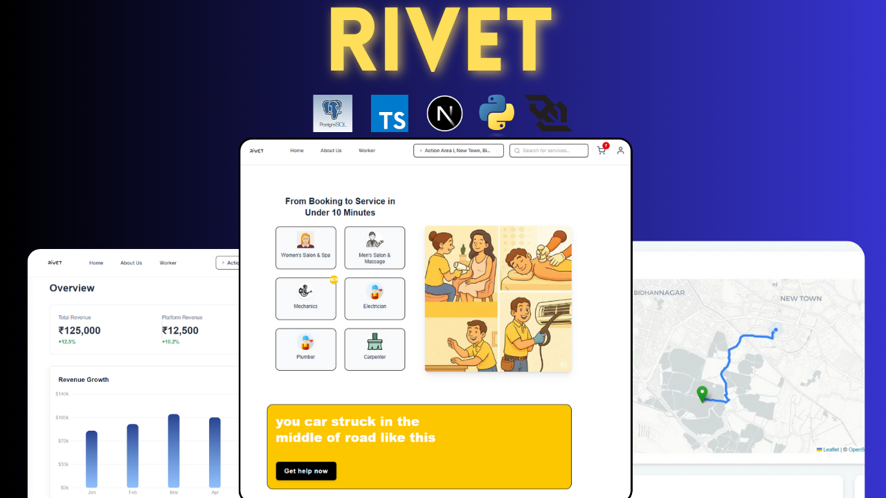

```markdown
# 🚀 RIVET — Real-Time Service Booking Platform

RIVET is a powerful real-time service booking platform that lets users find and book nearby skilled workers (like plumbers, electricians, and mechanics) instantly. With live tracking, voice-based booking, and a scalable microservice architecture, RIVET brings urban services to your doorstep with one tap.




---

## 🧠 Key Features

- 🔁 **Real-Time Location Tracking** with WebSockets + Leaflet
- 🎙️ **Voice-Based Booking System** powered by Gemini AI
- ⚡ **One-Tap Mechanic Booking**
- 🛰️ **Search Workers Within Radius** using PostGIS
- 💬 **Live Worker Updates** via Redis Pub/Sub
- 📡 **Socket.IO Live Communication**
- 🧠 **Smart Worker Matching** via Gemini AI
- 💸 **Secure Payments** via Razorpay
- ⛓️ **Immutable Booking Ledger** with Aptos Blockchain
- 👨‍🔧 **Worker Specializations & Reviews**
- 📅 **Scheduled or Instant Booking**
- 🔒 **RBAC + JWT Authentication**
- 🌍 **Map-Driven UI via Leaflet.js**

---

## 🧱 Tech Stack

| Layer        | Stack                                      |
|--------------|---------------------------------------------|
| Frontend     | **Next.js**, TypeScript, TailwindCSS        |
| Realtime     | **Socket.IO**, Redis Pub/Sub                |
| Backend      | **Node.js**, **Express**, **Drizzle ORM**   |
| Database     | **PostgreSQL**, PostGIS (location queries)  |
| AI Features  | **Gemini API** (for text, voice, matching)  |
| Payments     | **Razorpay** (INR-compatible)               |
| Auth         | Clerk / JWT                                 |
| Blockchain   | **Aptos** (for decentralized job logs)      |
| Maps         | **Leaflet.js** with OpenStreetMap           |
| Caching      | Redis                                       |

---

## 📦 Folder Structure (Simplified)

```

/rivet
├── src
│   ├── app.ts               # Express App Setup
│   ├── server.ts            # Socket.IO + Redis + HTTP Server
│   ├── config/              # Redis, Drizzle, Environment
│   ├── routes/              # API Route Handlers
│   ├── controllers/         # Business Logic
│   ├── db/schema.ts         # Drizzle ORM Models
│   ├── services/            # Redis, Notification, Voice AI
│   ├── socket/              # WebSocket Events
│   ├── workers/             # Background Queue Processors
│   └── utils/               # Geo, Logger, etc.

````

---

## ⚙️ How It Works

### 🔎 1. User Flow
1. User allows location or searches by area
2. User selects a job (e.g. plumber, mechanic)
3. Nearby skilled workers within 10km radius are shown
4. User books — either **now** or **schedules**
5. Worker accepts → real-time socket room established
6. Live map shows worker approaching user

### 🔄 2. Worker Flow
- Workers receive jobs via **Redis Pub/Sub**
- Accept jobs via socket event → worker locked
- Status changes: `pending → confirmed → in-progress → completed`
- Rating and review system enabled after job

---

## 🧠 AI-Powered Matching
Gemini API is used to:
- Generate smart matching prompts
- Handle **voice-based job descriptions**
- Provide intelligent job-time recommendations

---

## 🔐 Blockchain Integration (Aptos)
- Stores each completed job with:
  - Timestamp
  - User ID
  - Worker ID
  - Location hash
- Ensures immutable and auditable job history

---

## 💸 Payment Flow
- Razorpay order created on job booking
- Worker is paid after job completion (minus commission)
- Optional: integrate wallet payout or blockchain token drop

---

## 🛠️ Setup & Installation

```bash
git clone https://github.com/yourusername/rivet
cd rivet

# Install backend
cd backend
npm install

# Add .env file
cp .env.example .env

# Start Redis locally or via Docker
redis-server

# Start backend
npm run dev
````

---

## 🚧 Roadmap

* [x] Real-time booking and sockets
* [x] Redis notification + geo filter
* [x] Razorpay payments
* [x] Blockchain job logging (Aptos)
* [ ] Admin dashboard for jobs/workers
* [ ] Mobile app (Flutter)

---

## 🧪 Demo Credentials (for testing)

| Role   | Email                                     | Password |
| ------ | ----------------------------------------- | -------- |
| User   | [user@rivet.in](mailto:user@rivet.in)     | 123456   |
| Worker | [worker@rivet.in](mailto:worker@rivet.in) | 123456   |

---

## 🤝 Contributors

* Akash Laha — Full Stack Dev + Architect
* \[Your Team Members if any]

---

## 📄 License

MIT License — use freely with credits.

---

## 🌐 Live Demo

> Coming Soon at [https://rivet.app](https://rivet.app)

---

